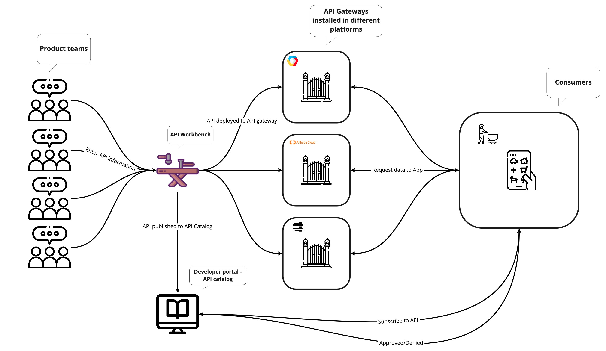
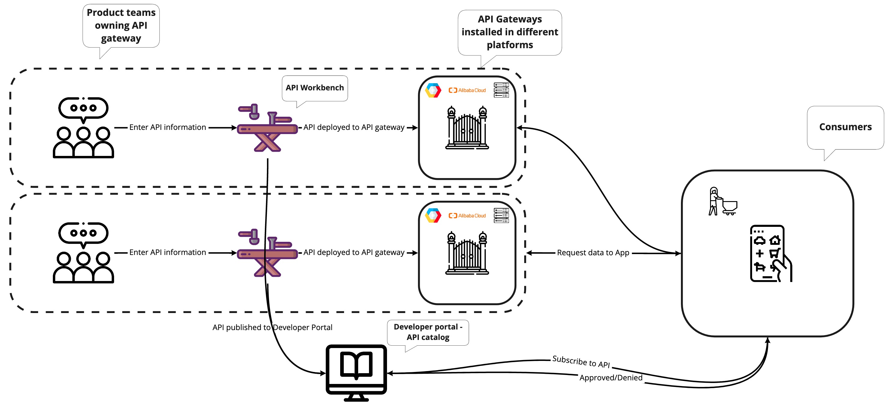

# API Management. Next step?

---

## Current setup


@snap[south span-100 text-gray text-08]
@[1-5]We can call this setup - Software as a Service
@snapend

---
@title[Benefits]

@snap[north-west span-55]
## Benefits
@snapend

@snap[west span-55]
@ul[list-spaced-bullets text-09]
- APIM takes care of infrastructure
- APIM takes care of support
- APIM takes care of cost
@ulend
@snapend

@snap[east span-45]

@snapend

---
## New setup


---
@title[Benefits]

@snap[north-west span-55]
## Benefits
@snapend

@snap[west span-55]
@ul[list-spaced-bullets text-09]
- Secure data
- Resolve support cases faster
- Achieve product team autonomy
@ulend
@snapend

@snap[east span-45]

@snapend

---

@snap[north-east span-100 text-pink text-06]
Let your code do the talking!
@snapend

```sql zoom-18
CREATE TABLE "topic" (
    "id" serial NOT NULL PRIMARY KEY,
    "forum_id" integer NOT NULL,
    "subject" varchar(255) NOT NULL
);
ALTER TABLE "topic"
ADD CONSTRAINT forum_id
FOREIGN KEY ("forum_id")
REFERENCES "forum" ("id");
```

@snap[south span-100 text-gray text-08]
@[1-5](You can step-and-ZOOM into fenced-code blocks, source files, and Github GIST.)
@[6,7, zoom-13](Using GitPitch live code presenting with optional annotations.)
@[8-9, zoom-12](This means no more switching between your slide deck and IDE on stage.)
@snapend


---?image=assets/img/code.jpg&opacity=60&position=left&size=45% 100%

@snap[east span-50 text-center]
## Now It's **Your** Turn
@snapend

@snap[south-east span-50 text-center text-06]
[Download GitPitch Desktop @fa[external-link]](https://gitpitch.com/docs/getting-started/tutorial/)
@snapend

