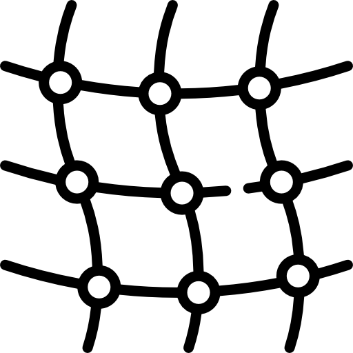

# API Management. Next step?

---

@snap[north center span-50]
## Today
@snapend

@snap[south span-90]

@snapend

@snap[south span-100 black text-08]
@[1-5](Recognize yourself?)
@[6,7, zoom-13](This is the current setup with API Management.)
@[8-9, zoom-12](Let's go over the benefits.)
@snapend

---
@title[Benefits]

@snap[north-west span-55]
## Benefits
@snapend

@snap[west span-55]
@ul[list-spaced-bullets text-09]
- APIM owns the infrastructure
- APIM own the support
- APIM owns the cost
@ulend
@snapend

@snap[east span-45]

@snapend

---
@snap[north center span-100]
## Tomorrow
@snapend

@snap[south span-100]

@snapend

@snap[south span-100 black text-08]
@[1-5](Pretty nice stuff yeah?)
@[6,7, zoom-13](This is a new service that we would like to offer.)
@[8-9, zoom-12](Let's go over the benefits.)
@snapend

---
@title[Benefits]

@snap[north-west span-55]
## Benefits
@snapend

@snap[west span-55]
@ul[list-spaced-bullets text-09]
- You own the API runtime
- You bare the cost for full transparency/accountability
- You own the support
@ulend
@snapend

@snap[east span-45]

@snapend

@snap[south span-100 black text-08]
@[1-5](And we provide the components)
@[6,7, zoom-13](making it super simple for you)
@[8-9, zoom-12](to provision the infrastructure)
@snapend

---?image=assets/img/code.jpg&opacity=60&position=left&size=45% 100%

@snap[east span-50 text-center]
### Looks nice? Stay tuned.
@snapend

@snap[south-east span-50 text-center text-06]
[Contact API Management on Slack @fa[external-link]](https://ingka.slack.com/archives/CNSCXHH33)
@snapend

